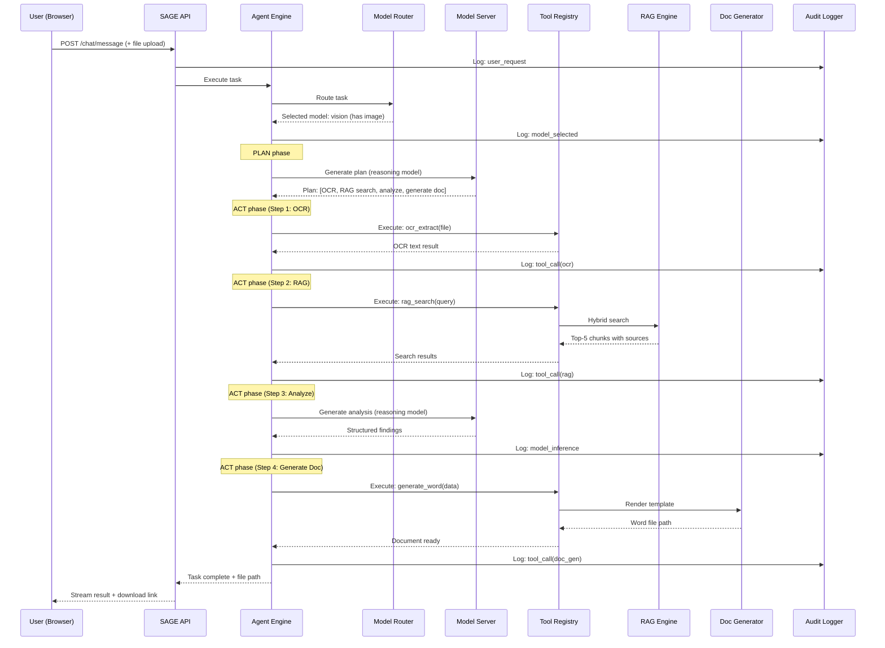

# SAGE Section 6 Supporting Architecture Details

## 36. Architectural Mistakes to Avoid

> [!WARNING]
> These are common pitfalls that kill SIH projects and real-world sovereign AI deployments.

| # | Mistake | Why It's Deadly | What To Do Instead |
|---|---------|----------------|-------------------|
| 1 | **Using LangChain for everything** | Massive dependency tree, telemetry phone-home, slow, abstracts away understanding | Build a lightweight custom agent loop (~500 lines). You'll understand every line. |
| 2 | **Treating RAG as "just embed and search"** | Industrial documents have structure (tables, cross-refs). Naive chunking destroys it. | Invest in structured document parsing. Use layout-aware chunkers. |
| 3 | **Single model assumption** | "We'll use Llama 3 for everything" → fails at vision, fails at code, stuck when better models emerge. | Model registry + router from day one. Abstract the model behind an interface. |
| 4 | **Ignoring model cold-load time** | Judges tap their feet for 30 seconds during demo. | Pre-warm all models before demo. Start model server processes at boot. |
| 5 | **Building a chatbot and calling it an agent** | Judges and MRPL reviewers will see through this immediately. | Show multi-step execution, tool calls, error recovery, and deliverable output. |
| 6 | **Over-engineering for production** | Kubernetes, Istio, Kafka — for a 3-person team's SIH submission. | Docker Compose. One machine. Modular monolith. Scale later. |
| 7 | **Ignoring the "proof" requirement** | Claiming "it's local" without evidence. | Network monitor, audit logs, and sovereignty report are **mandatory** demo components. |
| 8 | **Not handling LLM failures gracefully** | Model returns malformed JSON → entire workflow crashes → demo fails. | Validate every LLM output. Retry with modified prompts. Fallback to simpler approaches. |
| 9 | **Hardcoding prompts** | Different models need different prompt formats. | Prompt templates per model family in config, not in code. |
| 10 | **Embedding external CLI agents as runtime dependencies** | Fragile integration, loss of control, conflicting model management. | Build native coding agent within SAGE's agent engine. |
| 11 | **Using ChromaDB in production** | No ACID, no relational queries, another process to manage. | pgvector — one DB for everything. |
| 12 | **Skipping structured output validation** | Agent generates a document with missing fields → broken Word file. | Pydantic validation between LLM output and document generation. Always. |

---

## 37. Architecture Diagrams

### A. High-Level Architecture Diagram

```
┌─────────────────────────────── SAGE SYSTEM ────────────────────────────────┐
│                                                                             │
│   ┌─────────────┐         ┌──────────────────────────────────────────┐     │
│   │             │  HTTPS  │              SAGE BACKEND                │     │
│   │   Web UI    │◄───────►│                                          │     │
│   │  (Next.js)  │   WS    │   ┌──────────┐    ┌─────────────────┐   │     │
│   │             │         │   │ API Layer │───►│  Agent Engine    │   │     │
│   └─────────────┘         │   └──────────┘    │  ┌───────────┐  │   │     │
│                            │                   │  │  Planner  │  │   │     │
│                            │                   │  │  Executor │  │   │     │
│                            │                   │  │  Reflector│  │   │     │
│                            │                   │  └───────────┘  │   │     │
│                            │                   └────────┬────────┘   │     │
│                            │                            │            │     │
│                            │              ┌─────────────┼─────────┐  │     │
│                            │              │             │         │  │     │
│                            │         ┌────▼────┐  ┌─────▼────┐ ┌─▼──▼─┐  │
│                            │         │  Model  │  │   Tool   │ │ Doc  │  │
│                            │         │  Router │  │ Registry │ │ Gen  │  │
│                            │         └────┬────┘  └────┬─────┘ └──┬──┘  │
│                            │              │            │          │     │
│                            └──────────────┼────────────┼──────────┼─────┘
│                                           │            │          │
│   ┌───────────────────────────────────────┼────────────┼──────────┼─────┐
│   │            INFERENCE LAYER            │            │          │     │
│   │   ┌──────────────┐ ┌──────────────┐  │            │          │     │
│   │   │  llama.cpp /  │ │  llama.cpp / │  │            │          │     │
│   │   │  vLLM         │ │  vLLM        │◄─┘            │          │     │
│   │   │  (Reasoning)  │ │  (Vision)    │               │          │     │
│   │   └──────────────┘ └──────────────┘               │          │     │
│   └────────────────────────────────────────────────────┘          │     │
│                                                                    │     │
│   ┌───────────────────────────────────────────────────────────────┐│     │
│   │            DATA LAYER                                         ││     │
│   │   ┌──────────────┐ ┌──────────┐ ┌──────────┐ ┌────────────┐ ││     │
│   │   │ PostgreSQL   │ │  Redis   │ │  File    │ │  Sandbox   │ ││     │
│   │   │ + pgvector   │ │  Cache   │ │  System  │ │  (Docker)  │◄┘│     │
│   │   └──────────────┘ └──────────┘ └──────────┘ └────────────┘  │     │
│   └───────────────────────────────────────────────────────────────┘     │
│                                                                         │
│   ┌───────────────────────────────────────────────────────────────┐     │
│   │   SECURITY LAYER:  Firewall │ Network Monitor │ Audit Logger  │     │
│   └───────────────────────────────────────────────────────────────┘     │
└─────────────────────────────────────────────────────────────────────────┘
```

### B. Detailed Component Interaction Diagram



### C. End-to-End Data Flow Diagram

```
┌──────────────────────────────────────────────────────────────────────────┐
│                        DATA FLOW — ALL LOCAL                              │
│                                                                           │
│  INPUT                    PROCESSING                      OUTPUT          │
│  ─────                    ──────────                      ──────          │
│                                                                           │
│  ┌──────────┐    ┌─────────────┐    ┌──────────────┐    ┌──────────┐    │
│  │ User     │───►│ API Gateway │───►│ Agent Engine │───►│ Word Doc │    │
│  │ Upload   │    │ (validate,  │    │ (plan, act,  │    │ PPTX     │    │
│  │ (PDF,    │    │  auth,      │    │  observe,    │    │ XLSX     │    │
│  │  image,  │    │  log)       │    │  reflect)    │    │ Code     │    │
│  │  text)   │    └──────┬──────┘    └──────┬───────┘    │ Report   │    │
│  └──────────┘           │                  │            └──────────┘    │
│                          │                  │                            │
│                          ▼                  ▼                            │
│              ┌──────────────────────────────────────────┐               │
│              │           LOCAL SERVICES ONLY             │               │
│              │                                           │               │
│              │  Model Server ─ localhost:8001            │               │
│              │  PostgreSQL ─ localhost:5432              │               │
│              │  Redis ───── localhost:6379               │               │
│              │  Tesseract ── local process               │               │
│              │  Docker ──── unix socket                  │               │
│              │                                           │               │
│              │  ❌ NO EXTERNAL CONNECTIONS               │               │
│              └──────────────────────────────────────────┘               │
│                                                                           │
│  ┌──────────────────────────────────────────────────────────────────┐    │
│  │  AUDIT TRAIL: Every arrow above is logged with timestamp,       │    │
│  │  user_id, operation, input hash, output hash, latency.          │    │
│  └──────────────────────────────────────────────────────────────────┘    │
└──────────────────────────────────────────────────────────────────────────┘
```

---

## 38. Risks & Mitigations

| # | Risk | Probability | Impact | Mitigation |
|---|------|-------------|--------|------------|
| 1 | **Models too large for demo GPU** | Medium | CRITICAL | Use Q4_K_M quantization. Test on target hardware early. Have fallback to smaller models (Phi-4-mini). |
| 2 | **Model quality insufficient for agentic tool-calling** | Medium | HIGH | Test tool-calling extensively with chosen models. Qwen3 has strong tool-calling support. Use structured output enforcement. |
| 3 | **OCR quality poor on real industrial documents** | Medium | HIGH | Use PaddleOCR for complex layouts. Supplement with vision LLM. Pre-process images (deskew, denoise). |
| 4 | **RAG retrieval returns irrelevant results** | Medium | MEDIUM | Hybrid search (vector + BM25). Structured chunking with metadata. Manual evaluation of retrieval quality. |
| 5 | **Demo fails live** | Low | CRITICAL | Have pre-recorded backup. Pre-warm all models. Run demo 10+ times in rehearsal. |
| 6 | **Agent gets stuck in infinite loop** | Medium | MEDIUM | Hard step limit (15). Timeout per step (60s). Circuit breaker on model failures. |
| 7 | **Judges question sovereignty claim** | Low | HIGH | Three-layer proof: network monitor + firewall + verification report. Show tcpdump output live. |
| 8 | **Team burns out on scope** | High | HIGH | Strict MVP scope. Build foundation first. Add features incrementally. Resist feature creep. |
| 9 | **Docker/GPU issues on demo machine** | Medium | HIGH | Test on the exact demo hardware. Have a backup machine. Pre-build all Docker images. |
| 10 | **Model hallucinations in generated documents** | High | MEDIUM | Always include source attributions. Pydantic validation. Human-in-the-loop for production (not demo). |

---

## Summary: Build vs Integrate vs Avoid

| Component | Build | Integrate | Avoid |
|-----------|-------|-----------|-------|
| Agent orchestration loop | ✅ Custom | | LangChain/LangGraph (too heavy) |
| Model serving | | ✅ vLLM / llama.cpp server | Rolling your own inference |
| Model routing | ✅ Custom classifier | | LLM-based routing |
| Tool framework | ✅ Custom (simple) | | Heavy plugin frameworks |
| RAG pipeline | ✅ Custom ingestion/retrieval | ✅ pgvector, sentence-transformers | Managed RAG services |
| OCR | | ✅ Tesseract + PaddleOCR | Cloud OCR APIs |
| Vision understanding | | ✅ Qwen2.5-VL via model server | External vision APIs |
| Document generation | | ✅ python-docx-template, python-pptx, openpyxl | LibreOffice server (complex) |
| Code sandbox | | ✅ Docker | Unsandboxed `exec()` |
| Authentication | ✅ Simple JWT | | Keycloak (overkill for MVP) |
| Frontend | ✅ Custom Next.js | | Generic chat UI libraries |
| Database | | ✅ PostgreSQL + pgvector | MongoDB, multiple DBs |
| Coding agent | ✅ Custom agent profile | | External CLI tools as runtime dependency |
| Network monitoring | ✅ Custom (psutil + tcpdump) | | Expensive SIEM tools |

---

## Proposed Changes

### Phase 1 (Foundation + Agent Core)

#### [NEW] `docker-compose.yml` — Single-command deployment
#### [NEW] `backend/sage/main.py` — FastAPI entry point
#### [NEW] `backend/sage/agent/engine.py` — ReAct agent loop
#### [NEW] `backend/sage/agent/router.py` — Model routing logic
#### [NEW] `backend/sage/models/client.py` — Model server client abstraction (OpenAI-compatible)
#### [NEW] `backend/sage/models/registry.py` — Model registry
#### [NEW] `backend/sage/tools/base.py` — Tool base class + registry
#### [NEW] `backend/sage/tools/file_ops.py` — File I/O tools
#### [NEW] `backend/sage/api/chat.py` — Chat API + WebSocket
#### [NEW] `backend/sage/auth/service.py` — JWT auth
#### [NEW] `backend/sage/audit/logger.py` — Structured audit logger
#### [NEW] `backend/sage/config.py` — Configuration management
#### [NEW] `config/model_registry.yaml` — Model definitions
#### [NEW] `frontend/app/` — Next.js application scaffold
#### [NEW] `frontend/components/ChatWindow.tsx` — Main chat interface

### Phase 2 (RAG + Multimodal)

#### [NEW] `backend/sage/rag/` — Full RAG pipeline
#### [NEW] `backend/sage/multimodal/` — OCR + vision processing
#### [NEW] `backend/sage/tools/rag_search.py` — RAG search tool
#### [NEW] `backend/sage/tools/ocr.py` — OCR tool
#### [NEW] `backend/sage/tools/vision.py` — Vision analysis tool

### Phase 3 (Doc Gen + Coding Agent)

#### [NEW] `backend/sage/docgen/` — Document generation pipeline
#### [NEW] `backend/sage/sandbox/` — Code execution sandbox
#### [NEW] `backend/sage/agent/profiles/` — Agent profiles
#### [NEW] `templates/` — Document templates (.docx, .pptx)

### Phase 4 (Sovereignty + Polish)

#### [NEW] `backend/sage/audit/network_monitor.py` — Network monitoring
#### [NEW] `scripts/verify-sovereignty.sh` — Verification script
#### [NEW] `scripts/airgap-bundle.sh` — Air-gap deployment bundler

---

## Verification Plan

### Automated Tests
- `pytest backend/tests/` — Unit and integration tests
- `pytest backend/tests/test_sovereignty.py` — Network verification tests
- `npm test` in frontend — Component tests

### Manual Verification
- Run full inspection workflow end-to-end
- Run coding workflow end-to-end
- Run `sage-admin verify-airgap` on target hardware
- Demo rehearsal (3+ complete run-throughs)
- Test on exact SIH demo hardware
