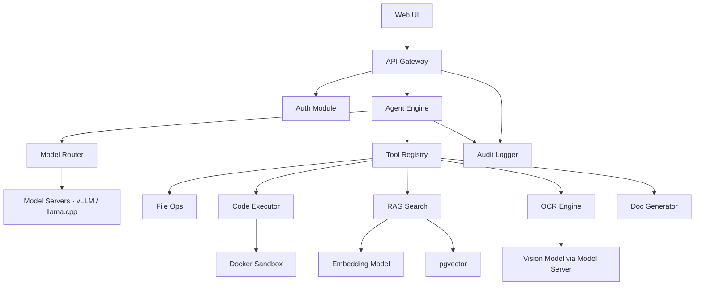

# SAGE — Section 1: Architecture & Foundation

**SIH Problem Statement:** SIH26117 — Sovereign On-Premise Agentic AI Workbench  
**Sponsoring Organization:** Mangalore Refinery and Petrochemicals Limited (MRPL)  
**Date:** 2026-08-26

---

## 1. Executive Summary

SAGE is an **air-gap-capable, on-premise agentic AI workbench** designed for organizations handling classified or confidential industrial data — refineries, PSUs, defence-linked manufacturing, and government offices. It is not a chatbot with a local model. It is a **multi-model orchestration platform** with genuine agentic capabilities: planning, tool-calling, multi-step execution, error recovery, and verified deliverable generation.

### Core Design Principles

| # | Principle | Implication |
|---|-----------|-------------|
| 1 | **Zero Egress** | No byte leaves the org boundary. Provably. |
| 2 | **Model Pluralism** | No single-model dependency. Router selects the best model per task. |
| 3 | **Agent, Not Chatbot** | ReAct-style planning loops with tool-calling, not turn-by-turn Q&A. |
| 4 | **Deliverable-Oriented** | Outputs are Word docs, PPTX, XLSX, code files — not just chat text. |
| 5 | **Extensible** | New models, new tools, new document types can be added without redesign. |
| 6 | **Auditable** | Every inference, tool call, file operation, and network packet is logged. |

---

## 2. Critical Corrections to Proposed Assumptions

> [!CAUTION]
> The following corrections challenge assumptions in the original proposal. Read before proceeding.

### 2.1 Build a Native Coding Agent — Don't Embed External CLI Tools

**Principle:** The coding agent must be a **native agent profile** within SAGE's own orchestration layer — not a wrapper around an external CLI tool. The coding agent is just another agent profile with specialized tools (file I/O, subprocess, linter). This keeps the architecture unified, the agentic loop fully under your control, and audit logging comprehensive.

### 2.2 Plan for Concurrent Multi-Model Serving

SAGE needs to serve **multiple models concurrently** (e.g., a reasoning model + a vision model for the inspection workflow). vLLM supports this natively through its multi-model serving capability. For the SIH demo on constrained hardware, use llama.cpp server instances (one per model, loaded on-demand) as a lightweight alternative.

### 2.3 "Air-Gapped" ≠ "Never Connects to Internet"

The system must be **capable** of running air-gapped. But it should also work on a standard internal network. The architecture must support both modes — an `AIRGAP_MODE=true` flag that blocks all egress and enables offline fallbacks, not an architecture that *only* works offline.

### 2.4 RAG Without Proper Chunking/Indexing Is Useless

Many SIH submissions treat RAG as "embed documents → vector search → done." Industrial documents (SOPs, P&IDs, inspection reports) are **structurally complex** — tables, cross-references, numbered sections. Naive chunking destroys this structure. SAGE must invest heavily in **document parsing and structured chunking** before embedding.

---

## 3. System Architecture

### High-Level Architecture

```
┌─────────────────────────── ORGANIZATION BOUNDARY ───────────────────────────┐
│                                                                              │
│  ┌──────────┐    ┌──────────────────────────────────────────────────────┐    │
│  │  Web UI   │◄──►│                  SAGE BACKEND                       │    │
│  │ (Next.js) │    │  ┌────────────┐  ┌────────────┐  ┌──────────────┐  │    │
│  └──────────┘    │  │   API      │  │   Agent    │  │   Document   │  │    │
│                   │  │   Gateway  │  │   Engine   │  │   Generator  │  │    │
│                   │  └─────┬──────┘  └─────┬──────┘  └──────┬───────┘  │    │
│                   │        │               │                │          │    │
│                   │  ┌─────▼───────────────▼────────────────▼───────┐  │    │
│                   │  │              MODEL ROUTER                    │  │    │
│                   │  └─────┬──────────────┬──────────────┬──────────┘  │    │
│                   │        │              │              │             │    │
│                   │  ┌─────▼──────┐ ┌────▼──────┐ ┌────▼──────────┐  │    │
│                   │  │  vLLM /    │ │  vLLM /   │ │   vLLM /      │  │    │
│                   │  │  llama.cpp │ │  llama.cpp│ │   llama.cpp   │  │    │
│                   │  │  (Reason)  │ │  (Code)   │ │   (Vision)    │  │    │
│                   │  └────────────┘ └───────────┘ └───────────────┘  │    │
│                   │                                                   │    │
│                   │  ┌────────────┐  ┌────────────┐  ┌────────────┐  │    │
│                   │  │  Tool      │  │  RAG       │  │  Sandbox   │  │    │
│                   │  │  Registry  │  │  Engine    │  │  (Docker)  │  │    │
│                   │  └────────────┘  └────────────┘  └────────────┘  │    │
│                   └──────────────────────────────────────────────────────┘    │
│                                                                              │
│  ┌──────────────────────────────────────────────────────────────────────┐    │
│  │  INFRASTRUCTURE:  PostgreSQL + pgvector  │  Redis  │  Audit Logger  │    │
│  └──────────────────────────────────────────────────────────────────────┘    │
│                                                                              │
│  ┌──────────────────────────────────────────────────────────────────────┐    │
│  │  NETWORK MONITOR:  iptables/nftables firewall  │  tcpdump logger    │    │
│  └──────────────────────────────────────────────────────────────────────┘    │
└──────────────────────────────────────────────────────────────────────────────┘
```

### Architectural Style

**Modular Monolith** (not microservices).

**Why:** A small team building for SIH cannot maintain 15 Docker containers. A modular monolith gives you:
- Single deployment unit → simpler ops.
- Clear internal module boundaries → can be split later.
- Shared process → no inter-service serialization overhead.

The backend is a single Python (FastAPI) process with clearly separated modules. Heavy inference is delegated to external model server processes (vLLM or llama.cpp server).

---

## 4. Component Architecture

```
sage/
├── api/                    # FastAPI routes, WebSocket handlers
├── agent/                  # Agent orchestration engine
│   ├── planner.py          # Task decomposition, planning
│   ├── executor.py         # Step execution loop (ReAct)
│   ├── router.py           # Model selection logic
│   └── profiles/           # Agent profiles (coder, analyst, etc.)
├── models/                 # Model registry, model server client abstraction
├── tools/                  # Tool implementations (file I/O, code exec, etc.)
│   ├── registry.py         # Tool discovery and registration
│   ├── file_ops.py
│   ├── code_executor.py
│   ├── spreadsheet.py
│   ├── rag_search.py
│   ├── ocr.py
│   └── doc_generator.py
├── rag/                    # RAG pipeline
│   ├── ingestion.py        # Document parsing, chunking, embedding
│   ├── retriever.py        # Hybrid search (vector + BM25)
│   └── embedder.py         # Local embedding model client
├── docgen/                 # Document generation
│   ├── word.py
│   ├── pptx.py
│   ├── xlsx.py
│   └── templates/          # .docx/.pptx template files
├── multimodal/             # OCR, vision processing
│   ├── ocr_engine.py
│   ├── vision_processor.py
│   └── image_utils.py
├── sandbox/                # Code execution sandbox
│   ├── docker_sandbox.py
│   └── security.py
├── auth/                   # Authentication & authorization
├── audit/                  # Audit logging, network monitoring
├── config/                 # Configuration management
├── db/                     # Database models, migrations
└── core/                   # Shared utilities, schemas, exceptions
```

### Component Dependency Graph



---

## 5. Recommended Technology Stack

| Layer | Technology | Why | Alternatives |
|-------|-----------|-----|-------------|
| **Language** | Python 3.12+ | Dominant in AI/ML ecosystem; best library support | Go (for performance-critical components only) |
| **Web Framework** | FastAPI | Async, fast, OpenAPI docs built-in, WebSocket support | Flask (simpler but synchronous), Django (heavier) |
| **Agent Framework** | Custom (lightweight) | Full control over agentic loop; no framework lock-in | LangGraph (heavier but more features), smolagents (promising) |
| **Model Server** | vLLM (production) / llama.cpp server (demo) | vLLM: enterprise-grade, continuous batching, PagedAttention; llama.cpp: lightweight, cross-platform, GGUF quants | SGLang (alternative to vLLM) |
| **Vector DB** | PostgreSQL + pgvector | One DB for everything; ACID; no new infra | ChromaDB (simpler), Milvus (overkill for MVP) |
| **Relational DB** | PostgreSQL 16+ | Battle-tested, pgvector extension, JSON support | SQLite (dev only) |
| **Cache/Queue** | Redis | Session state, task queue, pub/sub for streaming | In-process queue (simpler for MVP) |
| **Frontend** | Next.js 14+ (App Router) | SSR, file-based routing, excellent DX, React ecosystem | Vite + React (lighter), SvelteKit |
| **Document Gen** | python-docx-template, python-pptx, openpyxl | Mature, template-driven, no external deps | LibreOffice CLI (heavier) |
| **OCR** | Tesseract + PaddleOCR | Tesseract: battle-tested; PaddleOCR: better for complex layouts | EasyOCR, Surya |
| **Embedding** | BGE-M3 (via sentence-transformers) | Multi-vector, local, high quality | Qwen3-Embedding, nomic-embed-text |
| **Sandbox** | Docker (with seccomp + resource limits) | Ubiquitous, well-understood isolation | Bubblewrap (lighter), Firecracker (stronger) |
| **Auth** | JWT + bcrypt (custom) | Simple, no external deps for air-gap | Keycloak (enterprise, heavier) |
| **Monitoring** | Structured JSON logs + Prometheus metrics | Local, no cloud dependency | Grafana + Loki (nicer UI) |
| **Containerization** | Docker Compose | Single-command deployment | Podman (rootless alternative) |

### Why Custom Agent Framework Over LangGraph?

> [!IMPORTANT]
> This is a deliberate design choice. Here's the trade-off analysis.

**LangGraph Pros:** Battle-tested, excellent state management, built-in retry/cycle handling, LangSmith observability.

**LangGraph Cons for SAGE:**
1. **Heavy dependency** — Pulls in LangChain ecosystem (hundreds of transitive deps). In an air-gapped environment, dependency management is a security concern.
2. **Abstraction mismatch** — LangGraph's graph abstraction adds complexity when your agent loop is fundamentally: `plan → select tool → execute → observe → repeat`.
3. **Model coupling** — LangChain's LLM abstractions add latency and make it harder to pass raw tool-calling schemas directly to the model server's OpenAI-compatible API.
4. **Air-gap risk** — LangChain frequently phones home for telemetry/analytics unless explicitly disabled.

**SAGE's approach:** A ~500-line custom ReAct loop with:
- Explicit state machine (plan → act → observe → reflect → complete/retry)
- Direct OpenAI-compatible HTTP API calls to vLLM / llama.cpp server (no middleware)
- Tool registry with schema introspection
- Structured logging at every step

This is simpler, faster, fully auditable, and has zero external dependencies.

---

> **Cross-References:**
> - Model Serving & Routing details → `02_Model_Serving_And_Agent_Orchestration.md`
> - Tool/Plugin & RAG details → `03_Tools_RAG_And_Multimodal.md`
> - Backend, Frontend & Security → `04_Backend_Frontend_And_Security.md`
> - Development Phases & Demo → `05_Development_Phases_And_Demo_Strategy.md`
> - Hardware, Testing & Deployment → `06_Hardware_Testing_And_Deployment.md`
