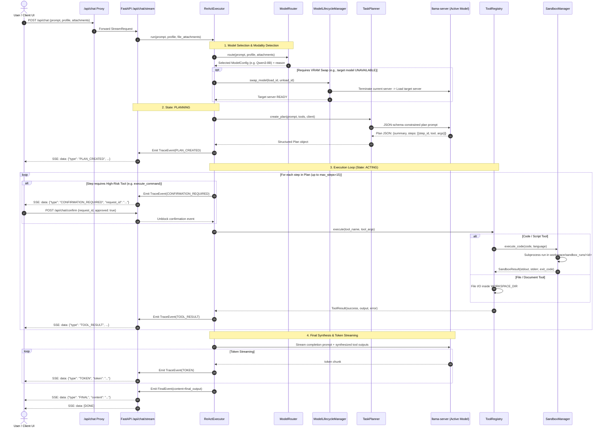
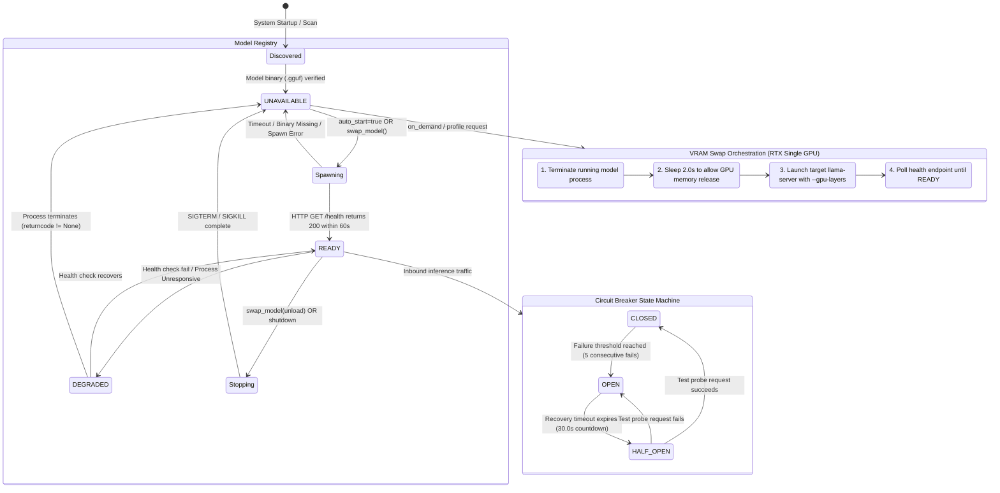
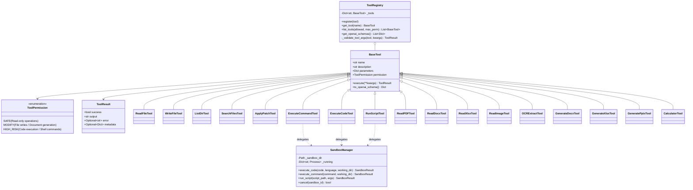
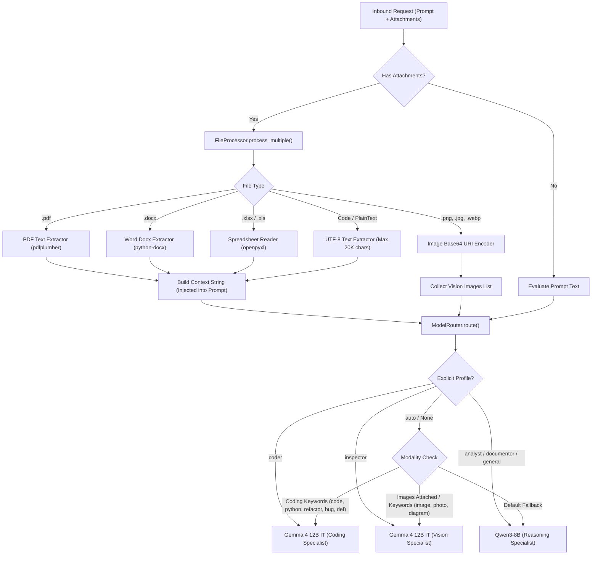
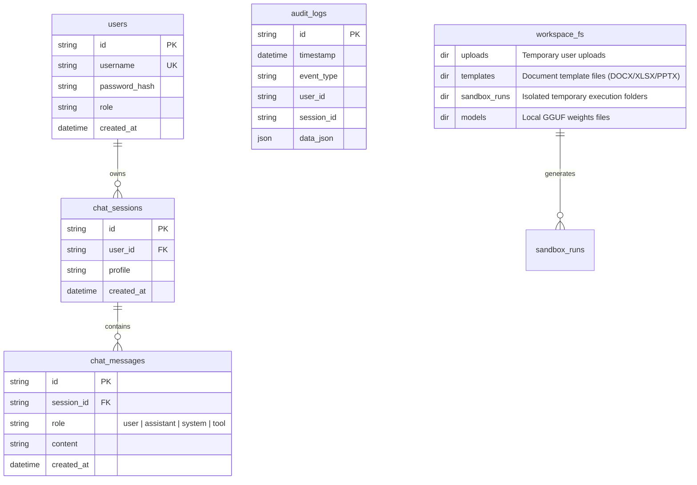

# SAGE (Sovereign Agentic AI Workbench) - Complete Architecture Specification

> **Notice**: This architecture document is reverse-engineered directly from the active codebase (`backend/`, `frontend/`, `cli/`, `config/`, `docker-compose.yml`, `run.bat`), completely omitting outdated external specifications.

---

## 1. System Overview & Layered Architecture

```mermaid
graph TB
    subgraph Clients["Client Tier"]
        UI["Modern Web Application\n(TanStack Start / React 19 / Vite / Bun / Tailwind)"]
        CLI["SAGE Terminal CLI\n(Typer / Rich / Python 3.11+)"]
    end

    subgraph EdgeProxy["Frontend Server / API Proxy (Bun / Node Runtime)"]
        ProxyChat["/api/chat (SSE Stream Transformer)"]
        ProxyModels["/api/models (Health & Model Status)"]
        ProxyActivate["/api/models/activate (VRAM Swap)"]
        ProxyConfirm["/api/chat/confirm (HITL Approval)"]
        ProxyUpload["/api/upload (File Ingestion)"]
    end

    subgraph BackendGateway["FastAPI Core Gateway (Port 8000)"]
        direction TB
        MW["Auth Middleware + CORS"]
        Audit["Structured Audit Logger\n(Air-gap Compliance)"]
        ExHandlers["Unified Error Envelope Handlers\n(SAGEError, HTTPException, Validation)"]

        subgraph Routers["API Routers"]
            R_Health["/health"]
            R_Chat["/api/chat (/completions, /stream, /confirm, /ws)"]
            R_Admin["/api/admin (/models, /models/{id}/activate)"]
            R_Tasks["/api/tasks (Status & Results)"]
            R_Upload["/api/upload (Multipart Ingestion)"]
            R_Auth["/api/auth (Tokens & Identity)"]
        end
    end

    subgraph AgentCore["Agent Orchestration Engine"]
        Executor["ReActExecutor\n(Multi-Step Planner + Actor + Reflector)"]
        Planner["Task Planner\n(OpenAI JSON-Schema Tool Planning)"]
        Router["ModelRouter\n(Profile, Modality & Keyword Routing)"]
        Profiles["ProfileManager\n(Analyst, Coder, Inspector, Documentor, General)"]
        StateTrace["ExecutionTrace & TraceEvent Store"]
    end

    subgraph ModelServing["Local Sovereign Model Serving"]
        Lifecycle["ModelLifecycleManager\n(Process Supervisor & Crash Watcher)"]
        Registry["ModelRegistry\n(model_registry.yaml + Auto-Scanner)"]
        GPUDet["GPUDetector\n(VRAM Profiler & Layer Offloading)"]
        CircuitBreaker["Global CircuitBreaker\n(Fail-Fast & Recovery Countdown)"]
        LLMClient["OpenAICompatibleClient\n(Streaming HTTP Client)"]
        
        subgraph Subprocesses["Local Inference Servers (llama-server / vLLM)"]
            Qwen["Primary: Qwen3-8B-Q4_K_M\n(Port 8001 | ~6GB VRAM | Reasoning / General)"]
            Gemma["Fallback / Specialist: Gemma 4 12B IT\n(Port 8002 | ~8GB VRAM | Coding / Vision)"]
        end
    end

    subgraph ToolsAndSandbox["Tools & Execution Sandbox"]
        ToolReg["ToolRegistry\n(18 Core Tools + Strict Schema Validation)"]
        Sandbox["SandboxManager\n(Subprocess Isolation in workspace/sandbox_runs/)"]
        DocGen["Document Generators\n(python-docx, openpyxl, python-pptx)"]
        DocRead["Document Readers & OCR\n(pdfplumber, openpyxl, Tesseract OCR)"]
        FileProc["FileProcessor\n(Multimodal Extractor & Text Chunker)"]
    end

    subgraph Persistence["Storage & Data Infrastructure"]
        PG[("PostgreSQL 16 + pgvector\n(users, audit_logs, chat_sessions, chat_messages)")]
        Redis[("Redis 7 Alpine\n(Heartbeat, Cache & Locks)")]
        FS[("Host Filesystem\n(workspace/, models/, config/, templates/)")]
    end

    %% Client to Edge
    UI --> ProxyChat & ProxyModels & ProxyActivate & ProxyConfirm & ProxyUpload
    CLI --> R_Health & R_Chat

    %% Edge to Backend
    ProxyChat --> R_Chat
    ProxyModels --> R_Admin
    ProxyActivate --> R_Admin
    ProxyConfirm --> R_Chat
    ProxyUpload --> R_Upload

    %% Gateway to Middleware & Routers
    MW --> Routers
    Routers --> Audit
    Routers --> ExHandlers

    %% Routers to Agent & Models
    R_Chat --> Executor
    R_Admin --> Lifecycle
    R_Upload --> FileProc

    %% Agent Engine Interactions
    Executor --> Router
    Executor --> Planner
    Executor --> Profiles
    Executor --> StateTrace
    Executor --> ToolReg
    Executor --> LLMClient
    Router --> Registry

    %% Model Serving
    Lifecycle --> Registry
    Lifecycle --> GPUDet
    Lifecycle --> Subprocesses
    LLMClient --> CircuitBreaker
    CircuitBreaker --> Subprocesses

    %% Tools & Sandbox
    ToolReg --> Sandbox
    ToolReg --> DocGen
    ToolReg --> DocRead
    FileProc --> FS
    Sandbox --> FS

    %% Persistence
    BackendGateway --> PG
    BackendGateway --> Redis
    BackendGateway --> FS
```

---

## 2. ReAct Agent Execution Loop & Event Streaming

---

## 3. Model Serving, VRAM Lifecycle & Circuit Breaker Architecture

---

## 4. Tool Registry, Permissions & Sandboxing Architecture

### Registered Tool Inventory by Permission Tier

| Permission Level | Tools | Description & Safety Invariant |
| :--- | :--- | :--- |
| **SAFE** | `read_file`, `list_dir`, `search_files`, `get_file_info`, `read_pdf`, `read_docx`, `read_xlsx`, `read_image`, `ocr_extract`, `calculator` | Read-only access constrained to `WORKSPACE_DIR`. Directory traversal strictly rejected. |
| **MODIFY** | `write_file`, `apply_patch`, `generate_docx`, `generate_xlsx`, `generate_pptx` | Mutation constrained within `WORKSPACE_DIR`. Automated rollback on patch conflict. |
| **HIGH_RISK** | `execute_command`, `execute_code`, `run_script` | Isolated subprocess in `workspace/sandbox_runs/<id>`. Triggers human-in-the-loop approval if `require_approval_for_high_risk=True`. |

---

## 5. Multimodal Ingestion & Dynamic Routing Pipeline

---

## 6. Data Model & Physical Persistence Topology

