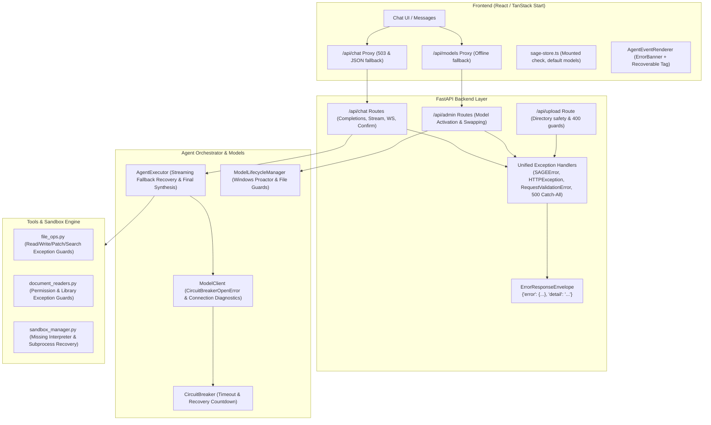

# SAGE End-to-End Error Handling Architecture Walkthrough

We conducted a comprehensive review of the entire SAGE project and implemented robust, consistent error handling across the backend, APIs, agent executor, tools, sandbox, and frontend without breaking existing workflows or backwards compatibility.

---

## 1. Architectural Improvements Overview



---

## 2. Key Changes by Component

### A. Core Exceptions & Response Contracts
- **Domain Exception Hierarchy** ([exceptions.py](file:///c:/Users/HP/Downloads/SAGE/backend/sage/core/exceptions.py)):
  - Added base `SAGEError(message, code, status_code, details)` with automatic dictionary serialization.
  - Implemented specific domain subclasses: `AuthError`, `PermissionDeniedError`, `ResourceNotFoundError`, `ValidationError`, `ModelError`, `CircuitBreakerOpenError`, `ToolError`, `ToolExecutionError`, `FileOperationError`, `SandboxError`, and `ConfigError`.
- **Unified Schemas** ([schemas.py](file:///c:/Users/HP/Downloads/SAGE/backend/sage/core/schemas.py)):
  - Created `ErrorDetail` and `ErrorResponseEnvelope`.
  - Maintained the top-level `detail` string alongside structured `error` to preserve full backwards compatibility with standard FastAPI/Starlette clients.
- **Global FastAPI Handlers** ([main.py](file:///c:/Users/HP/Downloads/SAGE/backend/sage/main.py)):
  - Registered exception handlers for `SAGEError`, `StarletteHTTPException`, `RequestValidationError`, and a global 500 catch-all.
  - Standard HTTP status codes (400, 401, 403, 404, 405, 409, 422, 429, 500, 502, 503, 504) are automatically mapped to readable semantic string codes (`NOT_FOUND`, `BAD_REQUEST`, etc.).

---

### B. Agent Engine & Model Serving Resilience
- **Process Lifecycle on Windows** ([lifecycle.py](file:///c:/Users/HP/Downloads/SAGE/backend/sage/models/lifecycle.py)):
  - Hardened `stop_all()` and `stop_model()` against Windows Proactor loop mismatches (`RuntimeError: Task got Future attached to a different loop`) and `ProcessLookupError`.
  - Added model weights file existence check in `_check_model_file()` before spawning subprocesses.
- **Circuit Breaker Diagnostics** ([circuit_breaker.py](file:///c:/Users/HP/Downloads/SAGE/backend/sage/models/circuit_breaker.py), [client.py](file:///c:/Users/HP/Downloads/SAGE/backend/sage/models/client.py)):
  - Added `get_remaining_recovery_time()` to expose how many seconds remain before half-open recovery.
  - Replaced generic `ModelError` with `CircuitBreakerOpenError` carrying exact remaining recovery countdown.
  - Augmented connection refused and timeout errors with actionable local model diagnostics.
- **Streaming Recovery in Agent Executor** ([executor.py](file:///c:/Users/HP/Downloads/SAGE/backend/sage/agent/executor.py)):
  - Added automatic fallback to secondary model if the primary model stream fails mid-generation.
  - Added live token SSE streaming during the `final_response_mode` fallback synthesis so the user is never left hanging on an empty screen.

---

### C. API Endpoints
- **Chat Endpoints** ([chat.py](file:///c:/Users/HP/Downloads/SAGE/backend/sage/api/chat.py)):
  - Added `try...except` exception guards across `/completions`, `/stream`, `/confirm`, and `/ws/{session_id}`.
  - Emits SSE error event frames `data: {"type": "ERROR", ...}` so streaming clients receive structured errors even after headers are sent.
- **Admin Endpoints** ([admin.py](file:///c:/Users/HP/Downloads/SAGE/backend/sage/api/admin.py)):
  - Clear differentiation between 404 (model not in registry), 400 (model file missing on disk), and 500 (swap failure).
- **Upload Endpoints** ([upload.py](file:///c:/Users/HP/Downloads/SAGE/backend/sage/api/upload.py)):
  - Handled `OSError` on upload directory creation.
  - Returned 400 Bad Request when all file uploads fail instead of silent partial failures.

---

### D. Tools & Sandbox Engine
- **File System Tools** ([file_ops.py](file:///c:/Users/HP/Downloads/SAGE/backend/sage/tools/file_ops.py)):
  - Wrapped all tools (`read_file`, `write_file`, `list_dir`, `search_files`, `get_file_info`, `apply_patch`) in path resolution guards.
  - Prevented directory traversal and file permission errors from raising unhandled exceptions, returning clean `ToolResult(success=False, error=...)`.
- **Document Readers** ([document_readers.py](file:///c:/Users/HP/Downloads/SAGE/backend/sage/tools/document_readers.py)):
  - Protected against missing optional libraries (`pdfplumber`, `python-docx`, `openpyxl`) and unreadable/corrupt files.
- **Sandbox Manager** ([sandbox_manager.py](file:///c:/Users/HP/Downloads/SAGE/backend/sage/sandbox/sandbox_manager.py)):
  - Added explicit handling for `FileNotFoundError` when target interpreters (`python`, `node`, `bash`) are not installed on the system.

---

### E. Frontend Resilience & UX
- **API Proxy Routes** ([chat.ts](file:///c:/Users/HP/Downloads/SAGE/frontend/src/routes/api/chat.ts), [models.ts](file:///c:/Users/HP/Downloads/SAGE/frontend/src/routes/api/models.ts)):
  - Wrapped upstream backend calls in `try/catch`, returning 503 JSON responses with friendly error messages instead of uncaught 500 crashes.
- **Store Safety** ([sage-store.ts](file:///c:/Users/HP/Downloads/SAGE/frontend/src/lib/sage-store.ts)):
  - Guarded against unmounted state updates and non-200 responses in `useModels()`. Fallback models are preserved seamlessly.
- **Chat View & Error Recovery** ([index.tsx](file:///c:/Users/HP/Downloads/SAGE/frontend/src/routes/index.tsx)):
  - **Fixed Message Deletion Anti-Pattern**: When a backend request fails or stream drops, the assistant message is **retained** in the chat thread with an `ERROR` event containing error details, instead of being abruptly deleted.
  - Wired an inline "Retry" action directly into the conversation.
- **Message Rendering & Thinking State** ([Messages.tsx](file:///c:/Users/HP/Downloads/SAGE/frontend/src/components/sage/Messages.tsx)):
  - **Fixed Zombie ThinkingDots**: Prevented infinite bouncing dots if a stream aborts or errors without generating tokens.
  - Rendered a styled "Retry request" button even when `message.content` is empty if an error event occurred.
- **Event Visuals** ([AgentEventRenderer.tsx](file:///c:/Users/HP/Downloads/SAGE/frontend/src/components/sage/AgentEventRenderer.tsx)):
  - Redesigned `ErrorBanner` with clear visual distinction, recovery badge (`Recoverable`), and readable error copy.

---

## 3. Verification & Validation Results

### Backend Automated Tests
Ran the full backend test suite with Pytest:
```
backend\.venv\Scripts\pytest
```
- **Result**: **52 passed** in 14.07s.
- Includes 4 new targeted error-handling tests in `tests/test_error_handling.py`:
  - `test_custom_sage_exceptions`: Verifies structured error codes and attributes.
  - `test_404_structured_envelope`: Verifies 404 routes return unified envelope with backwards-compatible `detail`.
  - `test_validation_error_structured_envelope`: Verifies 422 input validation returns unified error envelope.
  - `test_admin_nonexistent_model_activation_error`: Verifies 404 structured response when activating unknown models.

### Frontend TypeScript Compilation
Ran static type checking across the frontend:
```
bun x tsc --noEmit
```
- **Result**: Exited with code 0 (zero type errors or broken references).
